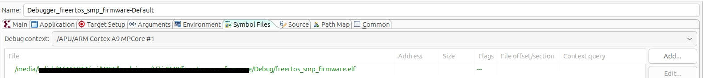

# FreeRTOS_SMP_Ethernet

FreeRTOS **SMP** firmware for the HardPix board (Xilinx Zynq-7000, dual-core
ARM Cortex-A9). It demonstrates symmetric multiprocessing across both cores and
runs a small UDP echo server over Ethernet.

Thanks to **Matth9814**: [github](https://github.com/Matth9814/FreeRTOS-Kernel-Community-Supported-Ports/tree/main/GCC/CORTEX_A9_Zynq7000).

## Overview

- **Kernel:** FreeRTOS-Kernel **V11.3.0** in SMP mode (`configNUMBER_OF_CORES = 2`,
  `configUSE_CORE_AFFINITY = 1`, `configRUN_MULTIPLE_PRIORITIES = 1`), with the
  community Cortex-A9 Zynq-7000 SMP port.
- **SMP demo (`main.c`):** two tasks pinned by affinity to separate cores
  exchange a message every 500 ms in a ping-pong fashion over two queues.
  - `prvPingTask` on **CPU0** sends a *ping* and waits for the *pong* reply.
  - `prvPongTask` on **CPU1** waits for the *ping* and sends a *pong* back.
- **Networking (`net/net_udp.c`):** a UDP echo server pinned to **CPU0**.
  - lwIP 2.1.1 in **RAW mode** (`NO_SYS = 1`, `LWIP_SOCKET = 0`); not thread-safe,
    so all lwIP work (init, `xemacif_input` poll, UDP callback) runs in a single
    task on CPU0.
  - EMAC = **GEM1** (XEMACPS dev 0, base `0xE000C000`, IRQ 77). The EMAC ISR is
    registered by `xemac_add()` and dispatched through the FreeRTOS
    `vApplicationIRQHandler`; IRQ 77 targets CPU0 by default.
  - PHY = **Microchip VSC8541** (RGMII). The BSP cannot identify it, so a custom
    `prvInitVSC8541()` (ported from `Vitis/FirmwareEthernet`) configures it
    manually; PHY reset is driven over an AXI GPIO (active-low NRST).

## Network configuration

| Setting    | Value             |
|------------|-------------------|
| IP address | `192.168.1.157`   |
| Netmask    | `255.255.255.0`   |
| Gateway    | `192.168.1.1`     |
| UDP port   | `5001`            |
| MAC        | `5e:4c:1a:77:7e:0a` |

Test from a PC:

```sh
nc -u 192.168.1.157 5001    # the datagram is echoed back and printed on the UART
```

## Ethernet dependency (Platform Project)

The Ethernet part **requires the `lwip211` library to be enabled in the Platform
Project** (BSP). Without it the lwIP headers/sources are not available and the
firmware will not build.

The Ethernet support is, however, **fully optional** and can be removed
completely if only the SMP demo is needed. To strip it out, roughly:

1. Remove the `net/` directory (`net_udp.c`, `net_udp.h`, `vsc8541_regs.h`) from
   the source tree.
2. In `main.c`, remove the `#include "net/net_udp.h"` and the
   `vStartNetworkTask()` call.
3. Disable / remove the `lwip211` library in the Platform Project (and rebuild
   the BSP).
4. Rebuild the application.

## Source layout

```
src/
├── main.c              SMP ping-pong demo + startup
├── net/
│   ├── net_udp.c       UDP echo server, VSC8541 PHY init (CPU0)
│   ├── net_udp.h
│   └── vsc8541_regs.h  VSC8541 register map
├── utility/            trace + global-timer helpers (Percepio / custom trace)
└── FreeRTOS_SMP/       vendored FreeRTOS-Kernel V11.3.0 (SMP) + Cortex-A9 port
```

## Debug

This is an SMP application, so debugging code that runs on **CPU1** requires the
debugger to load the symbols for the second core explicitly. By default the
launch only loads symbols for CPU0, so breakpoints in CPU1 code (e.g.
`prvPongTask`) hit only at the assembly level until the CPU1 symbols are added.

### Solution A – GUI "Symbol Files" tab (works, recommended when launching via the icon) ✅

When you start the debug session **via the icon** (toolbar bug →
"Debugger_freertos_smp_firmware-Default"), the `.launch` configuration is used and
the **TCL script is NOT executed**. The symbols for core 1 are added in the Debug
Configurations:

1. `Run → Debug Configurations…` → `Single Application Debug` →
   `Debugger_freertos_smp_firmware-Default` → the **Symbol Files** tab.
2. **Debug context** (the drop-down at the top) → select
   **`/APU/ARM Cortex-A9 MPCore #1`**.
   - ⚠️ This drop-down is populated **only while a debug session is running**
     (the contexts are read from the live connection). Without a running session
     it is empty and the **Add** button is greyed out.
3. **Add…** → select `freertos_smp_firmware/Debug/freertos_smp_firmware.elf`
   (leave Address/offset empty).
4. **Apply** → **Terminate** the running session → **Debug** again.

After relaunching, core 1 has its symbols → in `prvPongTask` on CPU1 the C source
shows up and normal source breakpoints work too (click in the editor margin).


